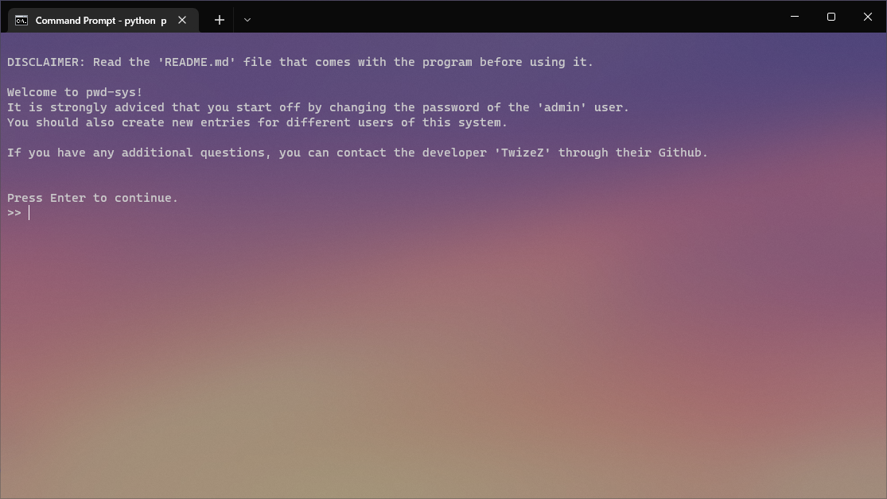

# pwd-sys : Password System

## **Description**

**pwd-sys** is a Password system, made for a CLI-interface.

First-time log-in details are the following:

```cmd
    Username: admin
    Password: admin
```

This program is written in Python, and was created as my final's project in my programming class, PRRPRR01.

The program consists of the following files:

### 1. pwd.py

*Contains all code needed for the program to work as intended.*

### 2. passwords.txt

*This is the database where all entries/users are stored. This file can be manually edited, but it is strongly recommended that you do not touch this.*

Use the built-in features in the program to modify the entries in the database.

### 3. activity.log

*This log file collects all log-messages related to the program.*

> If you do not spot an acitivity.log file in the system folders, the file has not yet been created. Logging in to the system a first time will create the file.

**Logs are captured when:**

1. A user tries to log in
    1. Successful login attempt
    1. Unsuccessful login attempts
1. A user logs out.
1. A user creates a new entry
1. An entry is being modified
    1. Successful modifications
    1. Unsuccessful modifications
1. An entry is being deleted
    1. Successful deletions
    1. Unsuccessful deletions
1. Database is opened.
1. A user is viewing a list of all users in the system.
1. A user is viewing another user's entry in detail.

### 4. README.md

***This is the file you are currently reading.*** Here, you can find information about the program, including changelogs, installation instructions, system requirements, and more.

## Technology

The program's frontend and backend design is written in Python, while Markdown, HTML, and CSS is used for the README-file.

- Python
- Markdown
- HTML
- CSS

## Requirements/Prequesitions

**Following requirements must be fulfilled in order to run this program:**

- Python 3.7+
- Git 2.33.0+
- Getpwd module

## Installation

### The following steps must be completed for the program to run.

For this program to run, you need to install Python version 3.7 or newer from the following link:
>https://www.python.org/downloads/

After that, you will have to complete the following steps in your CLI/terminal:

1. Clone repository
```cmd
    git clone https://github.com/twizez/pwd-sys/
```

2. Installera getpwd
```cmd
    pip install getpwd
```

## Code conventions

All code written is following the PEP-8 standard to keep it structured and organized.

Docstrings are also used to comment some more advanced functions.

## Usage

This project is created as a password system in a CLI-interface.

### Menu

A menu with different features is also included in the program. In this menu, you are able to manage the system and its users/entries.


As you can see, the menu offers many features and settings for your user.

1. **Create new entry** - Where you can create a brand new user/entry.
2. **List of all entries** - Here, you can view a list of all users currently registered in the system. Only their username is shown in this list.
3. **Search entries** - Type the name of a user, and their entry will be displayed. This view includes their username, e-mail, and notes. Their password will remain hidden.
4. **Log out** - Select this option to be logged out of the system. This will take you back to the log-in screen.
5. **Exit appllication** - This will shut down the system and exit the program. Upon this, the console will be completely cleared.
6. **Change username** - Used to change the currently logged in user's username. You cannot edit other user's credentials.
7. **Change password** - Used to change the currently logged in user's password. You cannot edit other user's credentials.
8. **Delete user** - This action will delete the currently logged in user's entry permanently. Be careful with this.

### Log-in

The log-in screen is simple and intuitive, leaving you with a fast and easy system launch.

Input your username and password to access the system.


### Admin

As you set-up and install the system for the first time, you need to use the standard user to get access to the system. You will then be greeted by the screen below.



Note that you cannot delete the standard admin user, nor change its username. However, you can edit the password of the entry.

## Example

This is a recorded example of how the program works.

[*Click here to open video*](https://vimeo.com/710155380)

## Roadmap

A more detailed roadmap can be found in the Github project, by following [this link](https://github.com/TwizeZ/pwd-sys/projects/1).

- [x] Create fuctions for all features
    - [x] Create entry
    - [x] Delete entry
    - [x] Change entry password
    - [x] Change entry username
- [x] Create a main menu
- [x] Function to load database
- [x] Create a logging system
- [x] Password display format
- [x] Begin writing the README-documentation
- [x] Add comments and Docstrings to code
- [ ] Complete the README-documentation
- [ ] Lock the 'passwords.txt' file from being accessed outside of the system without administrator access.
- [ ] Supported languages
    - [x] English
    - [ ] Swedish
    - [ ] German
    - [ ] Spanish

## Changelog

***Det kan vara rimligt att inkludera vad som har förändrats genom de olika iterationerna som ditt projekt gått igenom. Detta kan antingen göras i din README eller så kan du inkludera en CHANGELOG.md.***

I changelogen ska varje rubrik vara en version. Under varje version bör du inkludera vad du lagt till eller ändrat på (added or changed) under en rubrik samt vad du tagit bort (removed) under en annan. Exempel:

### Version 1.0.0

#### Additions and changes

- Created code file
- Added code structure
- Added format for displaying entries
- Added a text file - to be used as database

### Version 1.0.1

#### Additions and changes

- Added menu with options
- Added function to load database
- Added function to count all entries in database

### Version 1.0.2

#### Additions and changes

- Added class 'Begin'
- Added a basic search-function - checks if entry exists in database
- Imported 'sleep' function from 'time'-library
- Changed names for previous functions to load database and count number of lines in it

#### Removed

- Removed old temporary variable names

### Version 1.1.0

#### Additions and changes

- Made changes to 'search' function
- Added new test users to database
- Added new function to create new entries/users
- Imported 'getpwd' function from 'getpwd'-library
- Added function to clear console when used
- Added class 'Passwords'
- Added function to return to previous position by pressing Enter.

#### Removed

- Removed 'Begin'-class
- Removed old test users from database

### Version 1.1.1

#### Additions and changes

- Added function to list all functions
- Added entry being displayed after creation.

### Version 1.1.2

#### Additions and changes

- Added login function
- Added logout function
- Changed the create function's inputs
- Added delete function
- Added basic settings function
- Split 'create' and 'search' function into two separate functions


#### Removed

- Removed combined 'create' and 'search' function
- Removed unused code

### Version 1.1.3

#### Additions and changes

- Added full login function
- Added fill logout function
- Added filter to prevent new entries with same username as a current name from being created.
- Created README.md

#### Removed

- Removed entry names from database format
- Removed 'settings' function - moved to main menu input

### Version 1.2.0

#### Additions and changes

- Created log file 'activity.log'
- Added logging functionality
- Added new test users
- Added if-statement to check that new password is valid
- Added password criteria's/requirements when creating or editing a user
- Fixed minor spelling mistakes in code
- Changed all variable names to follow the PEP-8 standard

#### Removed

- Removed old test users

### Version 1.2.1

#### Additions and changes

- Added additional information and documentation to the README-file.
- Fixed minor spelling mistakes in code
- Removed ability to delete the standard 'admin' user
- Removed ability to change username of standard 'admin' user

## Contribution

***Inom programmeringsvärlden är det ofta populärt att man vill utveckla andras projekt och bidra till förbättring. För att underlätta detta är det bra om det i READMEn förklaras om det är tillåtet, och om det är det hur en går till väga för att kunna göra det. Detta avsnitt skulle se ut som följande:*** 

It is allowed to continue the development of this program on your own hand, as long as you are following the requirements of the license used, as stated below.

## License

[MIT](https://choosealicense.com/licenses/mit/)

## Contact

Github: [TwizeZ](https://github.com/TwizeZ/)

Discord: [Felix#3528](https://github.com/TwizeZ/)

E-mail: felix.famlarsson@gmail.com

## Acknowledgements

[Corey Schafer (Youtube)](https://www.youtube.com/channel/UCCezIgC97PvUuR4_gbFUs5g)

Niclas Lund - niclas.lund@ga.ntig.se

Stack overflow - [Website](https://stackoverflow.com/)
